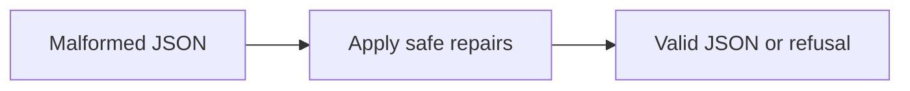

<!-- readme-refresh:start -->
<p align="center">
  <picture>
    <source media="(prefers-color-scheme: dark)" srcset="assets/readme-banner.png">
    <source media="(prefers-color-scheme: light)" srcset="assets/readme-banner.png">
    
  </picture>
</p>

<h1 align="center">🩹 JSONMend</h1>

<p align="center"><strong>Conservatively repair common malformed JSON from agents and CLI tools.</strong></p>

<p align="center">
  <a href="https://github.com/al1re3a/jsonmend/actions/workflows/ci.yml"></a>
  <a href="https://www.rust-lang.org/"></a>
  <a href="LICENSE"></a>
  <a href="https://github.com/al1re3a/jsonmend/stargazers"></a>
  <a href="https://github.com/al1re3a/jsonmend/issues"></a>
</p>

<p align="center">
  <a href="https://github.com/al1re3a/jsonmend"></a>
  <a href="#install"></a>
  <a href="CONTRIBUTING.md"></a>
  <a href="SECURITY.md"></a>
</p>

<p align="center">
  
</p>

> [!NOTE]
> JSONMend prefers a clear refusal over an ambiguous rewrite. Always validate repaired data against your application schema.

## 📑 Contents

- [At a glance](#-at-a-glance)
- [Install](#install)
- [Scope and safety](#scope-and-safety)
- [Development](#development)

---

## 🔎 At a glance

| | |
|---|---|
| **Purpose** | Conservatively repair common malformed JSON from LLMs and command-line tools. Zero-dependency Rust CLI. |
| **Input** | Malformed JSON |
| **Output** | Valid JSON or refusal |
| **Runtime** | Rust 2021 edition |
| **CI** | ✅ Linux · macOS · Windows |
| **Status** | ✅ Maintained |

<details>
<summary><strong>🧭 How it works</strong></summary>



</details>

<details>
<summary><strong>📁 Repository layout</strong></summary>

```text
jsonmend/
├── .github/
├── src/
├── examples/
├── Cargo.toml
└── README.md
```

</details>

<details>
<summary><strong>🤝 Contributors</strong></summary>

<br>
<a href="https://github.com/al1re3a/jsonmend/graphs/contributors">
  
</a>

</details>
<!-- readme-refresh:end -->

Turn the small, predictable JSON mistakes produced by models and command-line tools into valid-looking JSON without a runtime or network call.

JSONMend removes Markdown fences and comments, normalizes single-quoted strings, quotes simple bare keys, removes trailing commas, and closes unfinished objects or arrays. It is intentionally conservative: it does not invent missing values or silently reorder data.

```console
$ jsonmend examples/broken.json.txt --explain
- removed Markdown fence
- removed comments
- converted single-quoted strings
- quoted unquoted object keys
- closed unterminated containers
- removed trailing commas
{"request_id": "req_42", ...}
```

## Install

```console
cargo install --path .
```

Pipe content through it, pass a file, or use `--check` in CI. `--check` exits with status 2 when a repair would be required.

## Scope and safety

JSONMend is a repair filter, not a schema validator. Validate the result with your normal JSON parser and schema before executing commands or persisting important data. Strings are processed without evaluating their contents.

## Development

```console
cargo fmt --check
cargo clippy --all-targets -- -D warnings
cargo test --all-targets
```

MIT licensed. Contributions are welcome.
